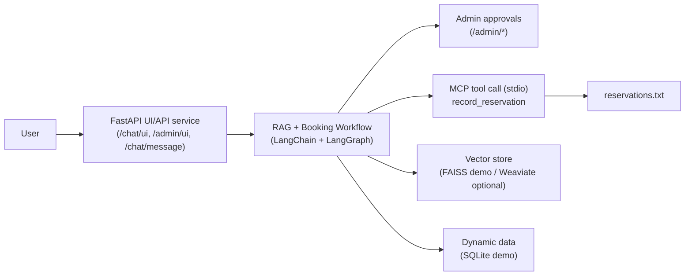
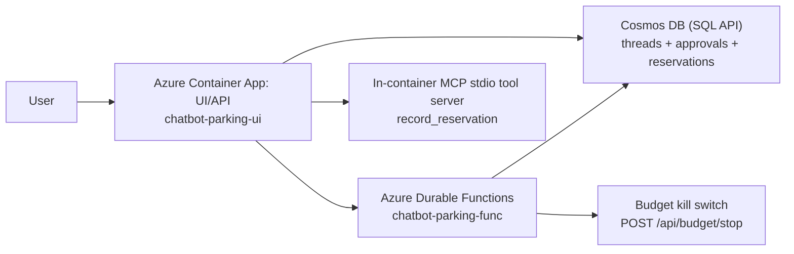

# Chatbot Parking Reservation

An end‑to‑end example of an intelligent parking reservation system that combines Retrieval‑Augmented Generation (RAG), a human‑in‑the‑loop approval flow, and a real MCP tool server (stdio transport). It’s designed to be small, understandable, and production‑oriented.

## What Is The Idea?

Users should be able to:

1. Ask natural questions about parking (hours, prices, locations, availability)
2. Book a spot conversationally by providing name, surname, car number, and period
3. Have a human administrator confirm/decline the booking (policy/compliance gate)
4. Persist approved bookings reliably to storage

This repo shows how to build that system with modern AI building blocks.

## Architecture At A Glance

### Local / Single-Process Demo



### Azure (Hybrid)



Key components:

- RAG chatbot for answers and reservation intake (LangChain)
- Vector store for knowledge (Weaviate; FAISS for demo)
- Human‑in‑the‑loop admin approvals (FastAPI API + simple Web UI)
- MCP stdio server for standardized reservation recording tool calls
- LangGraph to orchestrate the full workflow

## Live Azure Demo (If Deployed)

The UI service serves:

- Prompt UI: `/chat/ui`
- Admin UI: `/admin/ui`
- Version stamp: `/version`

To print the live URLs after deployment:

```bash
bash scripts/azure/inventory.sh rg-chatbot-parking-v2
```

## Quick Start (Demo Mode)

Demo mode uses FAISS + FakeEmbeddings + EchoLLM (default).

```bash
python -m venv .venv
source .venv/bin/activate
pip install -r requirements.txt
pip install -e .
python -m chatbot_parking.main
```

## Interactive CLI mode

Start the interactive loop and chat in free form or run guided booking:

### Windows (PowerShell)

```powershell
python -m chatbot_parking.main --interactive
```

### macOS/Linux

```bash
python -m chatbot_parking.main --interactive
```

### Demo prompts

Q&A examples:
- "What are the working hours?"
- "Where is the parking located?"
- "What are the prices?"

Booking example:
- Type: "reserve"
- Then provide: name, surname, car number, reservation period

Commands in interactive mode:
- `/help`
- `/exit`
- `/reset`

OpenAI-backed mode requires environment variables (for example `OPENAI_API_KEY`, `LLM_PROVIDER=openai`).
Without those settings, interactive mode still works in demo mode with local defaults.

## User Prompt + Admin UI

Run the unified UI/API server:

```bash
PYTHONPATH=./src python scripts/admin_server.py
# Open http://localhost:8000/chat/ui
```

Admin approval UI is available at `http://localhost:8000/admin/ui`.

## Try Manual Approval UI (60 seconds)

Run the lightweight admin server with the built‑in web UI and create a few test requests:

```bash
# 1) Start the Admin UI server (binds to 0.0.0.0:8000)
PYTHONPATH=./src python scripts/admin_server.py

# 2) Open the UI in your browser:
#    http://localhost:8000/admin/ui

# 3) (Optional) Seed a test request from another terminal
curl -X POST http://localhost:8000/admin/request \
	-H "Content-Type: application/json" \
	-d '{
		"name": "Alex",
		"surname": "Morgan",
		"car_number": "XY-1234",
		"reservation_period": "2026-02-20 09:00 to 2026-02-20 18:00"
	}'
```

Approve or decline in the browser—decided items disappear from the pending list.

## Ingest Static Documents (Demo/Real)

```bash
python data/ingest.py
```

## Running the Admin UI/API (Recommended)

```bash
export ADMIN_UI_TOKEN="$(python -c 'import secrets; print(secrets.token_urlsafe(32))')"
uvicorn chatbot_parking.web_demo_server:app --reload
```

Set `ADMIN_API_URL=http://localhost:8000` to submit booking requests from the orchestration.
Use `ADMIN_AUTO_APPROVE=true|false` to toggle auto-approval. When disabled, post a decision via
`POST /admin/decision` or inspect pending requests via `GET /admin/requests`.
Requests require `x-api-token: $ADMIN_UI_TOKEN` (legacy `ADMIN_API_TOKEN` is also accepted).

## MCP (Real Protocol, Stdio)

The reservation recorder is implemented as a real MCP server in:

- `src/chatbot_parking/mcp_servers/reservations_server.py` (tool definition)
- `src/chatbot_parking/mcp_servers/reservations_stdio_server.py` (stdio entrypoint)

The orchestration calls this MCP tool through `src/chatbot_parking/mcp_client.py`.

## Docker Compose (UI/API + Weaviate)

```bash
docker compose up --build
```

## Real Mode (Weaviate + HuggingFace embeddings + OpenAI LLM)

```bash
docker compose up -d weaviate
export VECTOR_BACKEND=weaviate
export WEAVIATE_URL=http://localhost:8080
export EMBEDDINGS_PROVIDER=hf
export LLM_PROVIDER=openai
export OPENAI_API_KEY=your-key
python data/ingest.py
python -m chatbot_parking.main
```

## Production DevOps (Azure + GitHub)

Production deployment assets are provided for a hybrid Azure runtime:

- Infrastructure-as-Code: `infra/azure/main.bicep`
- CI workflow: `.github/workflows/ci.yml`
- CD workflow: `.github/workflows/cd-azure-containerapps.yml` (UI container app + Durable Functions)
- Runbook: `docs/devops_production_azure_github.md`

Cloud architecture:

- `chatbot-parking-ui` Container App runs `chatbot_parking.web_demo_server:app` and serves `/chat/ui` + `/admin/ui`.
- Durable Function (`/api/chat/start`) executes chat turns.
- Cosmos DB stores thread state, admin approvals, and reservation records.
See the runbook for Azure OIDC configuration, required GitHub secrets/variables, and deployment steps.

## Security (OWASP LLM Top 10)

This project intentionally treats everything around the model as untrusted input (user messages, retrieved context, tool outputs)
and applies defense-in-depth guardrails.

Implemented highlights:

- Prompt-injection + system-prompt-leak detection (heuristics + strict prompting)
- PII/secret filtering and redaction across ingest → retrieval → output
- Least-privilege tool use: the MCP “record reservation” tool is triggered only after explicit user confirmation + human approval
- Bounded execution: message/context/output limits, durable polling timeouts, and request rate limiting in the UI/API service
- Safer web UI output handling: no `innerHTML` for untrusted values

Details and configuration knobs: `docs/guardrails.md`.

## Azure Well-Architected / AI Landing Zones (Portfolio Alignment)

This repo is not a full enterprise landing zone, but the Azure deployment follows several patterns from the
[Azure AI Landing Zones](https://github.com/Azure/AI-Landing-Zones) reference:

- Separate compute roles (UI/API service vs Durable orchestration)
- Centralized logs/telemetry (Log Analytics + Application Insights)
- GitHub OIDC for CI/CD (no long-lived Azure credentials in GitHub)
- Secrets handled as Azure Container Apps secrets (no plaintext tokens in image layers)
- Budget alert + “kill switch” hook (best-effort cost guardrail)

More details: `docs/azure_waf_and_ai_lz_alignment.md`.

Recommended production follow-ups (not fully implemented here):

- Front Door + WAF in front of the UI/API (bot protection, global edge, DDoS posture)
- Key Vault for secret governance/rotation (Cosmos access already supports Managed Identity via `COSMOS_USE_MANAGED_IDENTITY=true`)
- Private networking (VNet integration + Private Endpoints) for Cosmos/Storage where required
- API Management for auth, throttling, and request validation at the edge
- Dependency scanning and image vulnerability scanning in CI/CD

## Portfolio Takeaways (Ideas To Reuse)

- **RAG done with “security first” defaults**: chunking, metadata tagging, and retrieval filtering for private/injection-like content.
- **Human-in-the-loop as a hard gate**: approval is a workflow state, not a UI feature.
- **MCP as a tool boundary**: reservation recording is a real MCP stdio tool call, not a direct Python import.
- **Pluggable persistence**: Cosmos-backed state in cloud, in-memory fallback for local testing.
- **Hybrid cloud architecture**: Durable Functions for orchestration + Container Apps for user-facing UI/API.
- **Testing pyramid for AI workflows**: unit tests, MCP integration tests, and end-to-end booking+approval tests.
- **Operational guardrails**: smoke tests after deploy, cost budget alert, and conservative defaults for timeouts/limits.

## Evaluation

```bash
python -m chatbot_parking.eval.evaluate --write-report
```

Results are saved in `eval/results/` and `docs/evaluation_report.md` is updated.

## Project Layout

- `src/chatbot_parking/chatbot.py`: Core chatbot logic and reservation intake.
- `src/chatbot_parking/rag.py`: Vector store setup and retrieval.
- `src/chatbot_parking/admin_agent.py`: LangChain tool-backed human-in-the-loop approval stub.
- `src/chatbot_parking/admin_api.py`: Admin REST API for approve/deny actions.
- `src/chatbot_parking/mcp_servers/reservations_stdio_server.py`: MCP stdio server entrypoint.
- `src/chatbot_parking/mcp_client.py`: MCP stdio client used by orchestration.
- `src/chatbot_parking/orchestration.py`: LangGraph workflow.
- `data/static_docs.json`: Static documents for RAG ingestion.
- `data/ingest.py`: Ingestion script for guardrails + reporting.
- `docs/guardrails.md`: Guardrails summary and examples.

See `docs/evaluation.md` for guidance and `docs/evaluation_report.md` for the latest metrics report.

## Example Dialogue Flow

- User: "What are the working hours?"
- Assistant: returns hours + pricing + availability.
- User: "I want to book a spot."
- Assistant: collects name → surname → car number → reservation period.
- Admin: approves via the Web UI or `/admin/decision` API.
- Assistant: records to `data/reservations.txt` (through the MCP tool layer).

## Why This Matters

- Human‑in‑the‑loop keeps business rules and compliance in control
- MCP standardizes how AI calls tools/APIs—easier to extend and maintain
- LangGraph makes multi‑step flows explicit, testable, and reliable
- Guardrails protect from accidental sensitive data exposure

## Docs References

- LangChain Weaviate integration: https://python.langchain.com/docs/integrations/vectorstores/weaviate/
- LangChain embeddings: https://python.langchain.com/docs/integrations/text_embedding/
- LangChain chat models: https://python.langchain.com/docs/integrations/chat/
- Weaviate Docker deployment: https://weaviate.io/developers/weaviate/installation/docker-compose
- FastAPI dependencies & headers: https://fastapi.tiangolo.com/tutorial/dependencies/
- OpenAI API docs: https://platform.openai.com/docs
- Azure OpenAI docs: https://learn.microsoft.com/azure/ai-services/openai/

## Tests

```bash
pytest
```

## Load Test

```bash
python scripts/load_test_chat_message.py \
  --base-url http://localhost:8000 \
  --requests 50 \
  --concurrency 10
```
